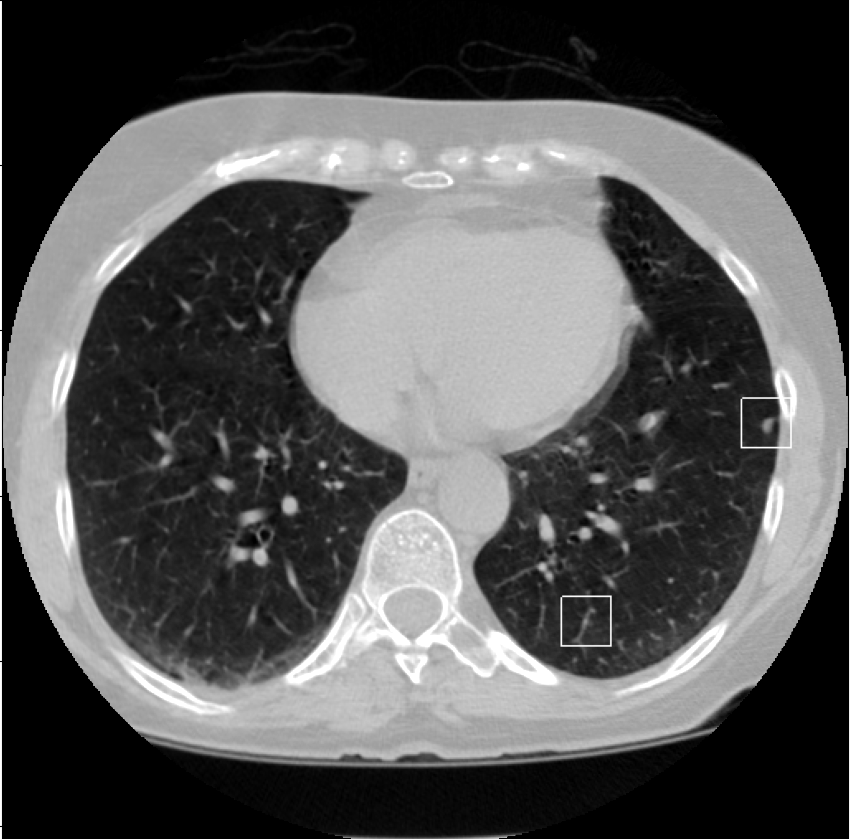

# Pseudo_Labels_NLST

This repository contains python scripts to read and visualize the pseudo lables of NLST database produced by the cooperative labeling [[1]](#1).
The script receives the pseudo labels generated by the cooperative labeling, and NLST scan directory and return the 3D numpy array and detection coordinates as a list.

## Requrienment
Python 3.10

## Instruction
- update the files directory in bbox_visualizations.py to your local directory
- python bbox_visualizations.py returns the scan in 3D numpy array and list of detections

## References
<a id="1">[1]</a> 
Maynord, M., et al. (2023). Semi‐supervised training using cooperative labeling of weakly annotated data for nodule detection in chest CT. Medical Physics.